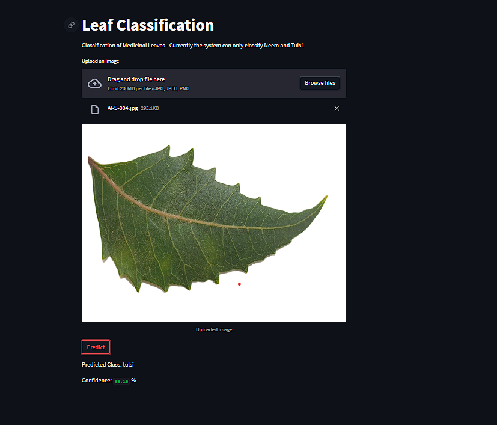

# Medicinal Plant Species Identification

This project involves designing and implementing an Artificial Intelligence and Machine Learning (AIML) model based on Convolutional Neural Network (CNN) architecture to accurately identify different medicinal plant species based on their leaves. The model achieved a prediction accuracy rate exceeding 85%, demonstrating its effectiveness in medicinal plant classification.

## Table of Contents
- [Introduction](#introduction)
- [Dataset](#dataset)
- [Results](#result)

## Introduction

Identifying medicinal plants accurately is crucial for various applications, including pharmacology and botany. This project leverages a Convolutional Neural Network (CNN) to classify medicinal plants based on leaf images, achieving high accuracy and demonstrating the potential of AIML in botanical studies. For the project, we only used Neem and Tulsi to train our model. 

## Dataset

The dataset consists of images of leaves from various medicinal plants. It is structured into species of leaves. The image dataset is distributed in training, testing and evaluation such that 80% for training, 10% for testing and 10% for evalution. Below link is the dataset used :-

[https://www.kaggle.com/datasets/aryashah2k/indian-medicinal-leaves-dataset/discussion?sort=undefined](https://www.kaggle.com/datasets/aryashah2k/indian-medicinal-leaves-dataset/discussion?sort=undefined)

[https://www.kaggle.com/datasets/warcoder/indian-medicinal-plant-image-dataset](https://www.kaggle.com/datasets/sharvan123/medicinal-plant)

## Results

The model achieved an accuracy of over 85% on the test dataset, indicating its effectiveness in identifying medicinal plant species based on their leaves.

